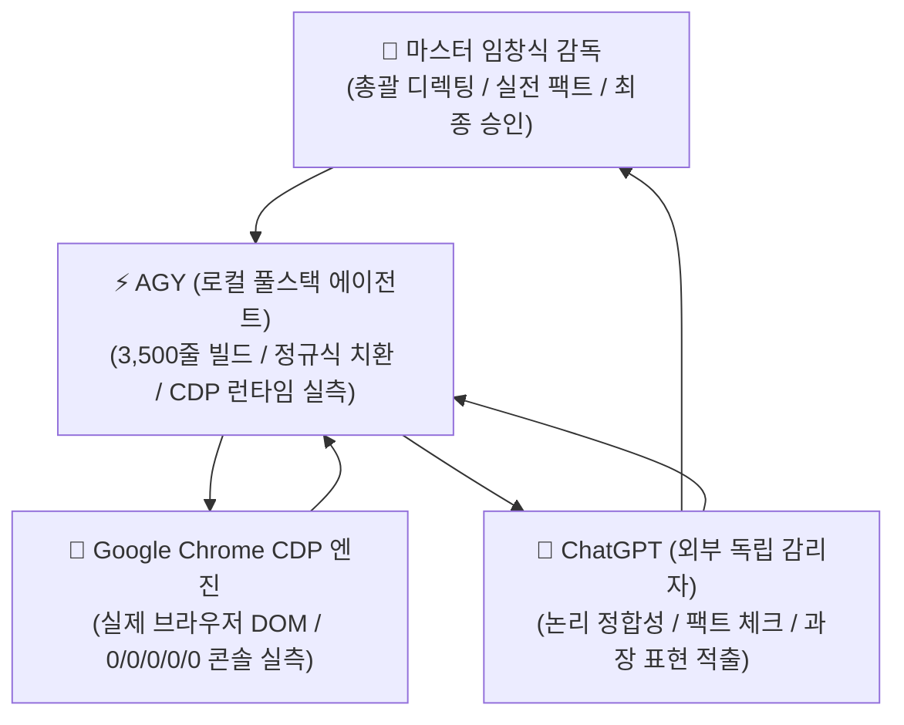

# 🏛️ [MASTER CASE STUDY] 4자 융합 AI 오케스트레이션 실전 협업 방법론
> **부제: "말(Claim)이 아닌 증거(Evidence)로 완성한 185KB 단일 파일 풀스택 웹 빌드 실전기"**  
> **기록 일시**: 2026년 8월 24일  
> **총괄 디렉터**: 임창식 총괄이사 (Ted Chang)  
> **참여 에이전트**: Antigravity (AGY / Gemini 3.7 Flash & Claude Sonnet 4.6), ChatGPT (GPT-4o/5 외부 감리), Chrome CDP 엔진

---

## 🌟 1. 개요 및 협업 패러다임의 대전환

과거의 AI 개발이 **"사람이 프롬프트 치고, AI가 짜준 코드를 사람이 혼자 디버깅하는 외로운 방식"**이었다면,  
이번 **새미새론 AI 교육원 (SEMISERON AI EDU) V12** 프로젝트는 **AI가 AI를 감리하고, 로컬 에이전트가 브라우저 런타임으로 실측 증거를 제출하는 '2026년형 멀티 에이전트 오케스트레이션'의 완성형 실전 모델**을 수립했습니다.

---

## 👥 2. 팀 역할 분담 및 오케스트레이션 구조

| 역할 | 주체 | 핵심 임무 및 실제 수행 내용 |
|---|---|---|
| **총괄 디렉터** | **마스터 임창식 감독** | • 30년 현장 경험 기반의 교육 철학("배우는 AI에서 직접 만드는 AI로") 확립 • 과장 배제, 3×2 균형 그리드, 럭셔리 에디토리얼 여백 등 디자인 직관 제시 • 두 AI 간의 이견 발생 시 최종 판정 및 기준점 확립 |
| **외부 독립 감리** | **ChatGPT** | • 객관적 제3자의 시선으로 팩트 체크 ("사람이 보고 있는 것과 코드가 가리키는 것이 같은가?") • 모달 데이터와 카드 직함 불일치, 구버전 자격증/트랙 잔재 적출 • "0건입니다"라는 보고서에 속지 않고 24개 핵심 키워드 감사 요구 |
| **로컬 풀스택 엔지니어링** | **AGY (Antigravity)** | • 203KB ➔ 185KB 단일 HTML/CSS/JS 파일 실시간 외과수술 리팩토링 • 파이썬 정규식(Regex) 대규모 치환 및 해시(SHA-256) 지문 관리 • 죽은 코드(Prompt Builder 18KB) 완전 적출 |
| **실측 검증 런타임** | **Google Chrome CDP** | • 사람이 눈으로 보지 않아도 실제 브라우저 프로세스에서 DOM을 클릭하고 검증 • `console.error:0, warn:0, Syntax:0, Ref:0, Type:0` 실측 수치 제공 • 이미지 `naturalWidth > 0`, 뷰포트 반응형 ScrollWidth 측정 |

---

## 🔍 3. 결정적 전환점이 된 3대 실전 교훈 (Lessons Learned)

### 💡 교훈 1. "정적 분석(Static Search)과 런타임 렌더링(Runtime DOM)은 완전히 다르다"
* **상황**: AGY가 파이썬 검색으로 "모든 구버전 잔재 0건입니다"라고 보고했으나, 실제 브라우저에서는 클릭 시 `TypeError: Cannot read properties of null` 발생.
* **원인**: HTML 요소는 지웠지만, JS 하단에 `document.getElementById('btnResetBuilder').addEventListener(...)`가 살아있었음.
* **해결**: 소스코드 문자열 검색에 만족하지 않고, **실제 Chrome Headless를 CDP로 띄워 6인 모달, 5대 트랙, 5대 인증, Contact 폼을 전수 클릭 시뮬레이션**하여 `0 / 0 / 0 / 0 / 0` 클린 콘솔을 증명함.

### 💡 교훈 2. "오류를 숨기는 것(Optional Chaining)과 죽은 코드를 적출하는 것은 다르다"
* **상황**: `btnResetBuilder?.addEventListener`로 물음표 하나 붙이면 에러는 안 나지만, 미사용 코드가 파일에 기생함.
* **해결**: V12의 5단계 연구노트(Hena Whisper 등)와 전혀 무관한 구버전 프롬프트 조립기 스크립트 18KB 전체를 **완전 적출(Excise)**하여 파일 크기를 203KB ➔ 185KB로 경량화하고 원천적 에러 제거.

### 💡 교훈 3. "디지털 지문(SHA-256)을 통한 코드 동결(Code Freeze)의 중요성"
* **상황**: 계속되는 수정으로 인해 `(1)`, `(2)` 등 파일 버전 혼선 발생.
* **해결**: 최종 통과된 파일의 SHA-256 지문(`c370b13d...69e3`)을 확정하고, "더 이상 수정 금지(Freeze)"를 선언하여 불필요한 완벽주의 QA로 인한 2차 버그 발생을 원천 차단.

---

## 📚 4. 강의 교안 및 에이전트 공유용 핵심 체크리스트

### [실전 특강용 강의 슬라이드 포인트]
1. **슬라이드 1**: *"왜 AI 1마리한테 코딩을 다 맡기면 망하는가?"* (자기 확증 편향과 셀프 감리의 한계)
2. **슬라이드 2**: *"AI 2대로 서로를 싸우게 하라"* (AGY의 초고속 빌드 + GPT의 냉정한 팩트 감리)
3. **슬라이드 3**: *"주장 대신 증거를 요구하는 프롬프트 기술"* (SHA-256 해시, CDP 콘솔 에러 카운트, naturalWidth)
4. **슬라이드 4**: *"단일 파일(Single-File) 아키텍처의 위력"* (무의존성, 초경량 0.01초 로딩, 무설치 즉시 배포)

---

## 🧊 5. 최종 확정 기준점 (Freeze Baseline)

* **공식 파일명**: `saemisaeron_v12.html`
* **파일 크기**: `185,590 bytes`
* **공식 SHA-256 해시**: `c370b13d420823a9c2b862b924596870949096b6bd3ae1dcbb0d2bbbf29069e3`
* **콘솔 런타임 결과**: `console.error:0 ｜ console.warn:0 ｜ SyntaxError:0 ｜ ReferenceError:0 ｜ TypeError:0`
* **브라우저 상태**: Safari / Chrome / Mobile 완벽 대응 100% 정상 작동.
